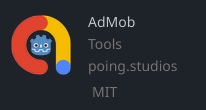
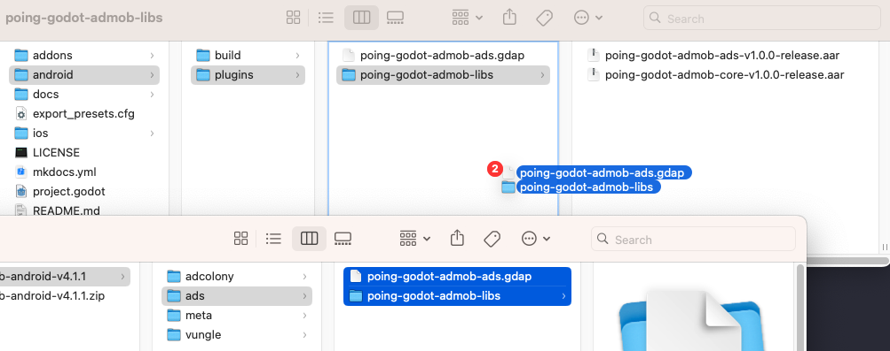
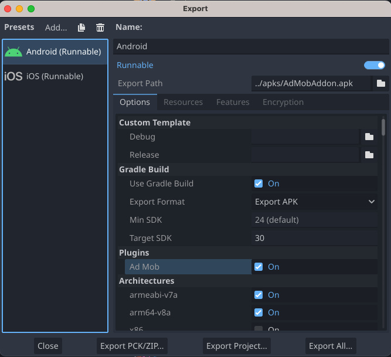
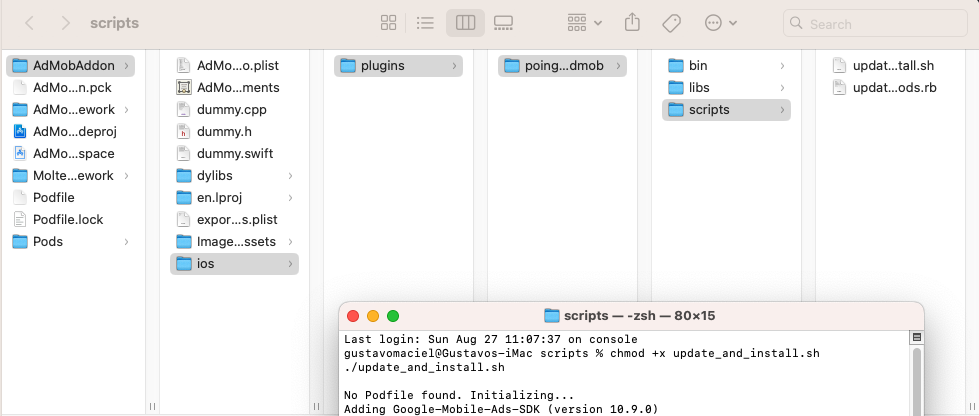
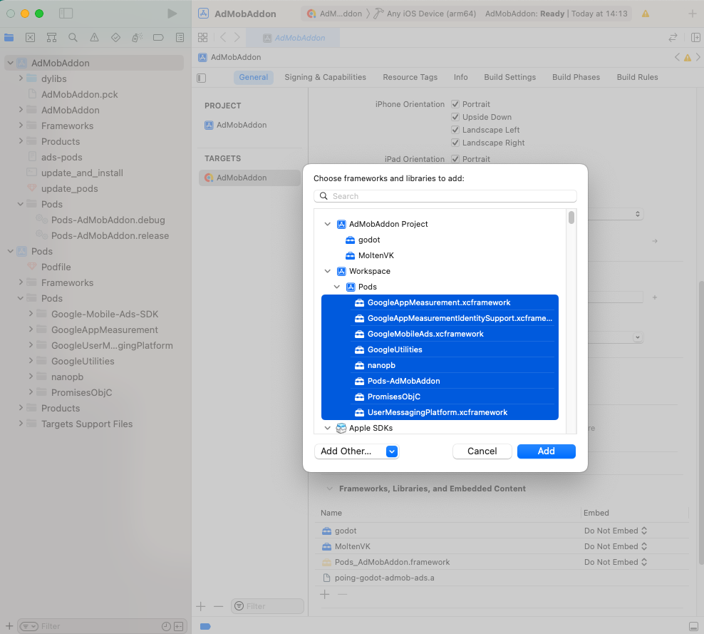
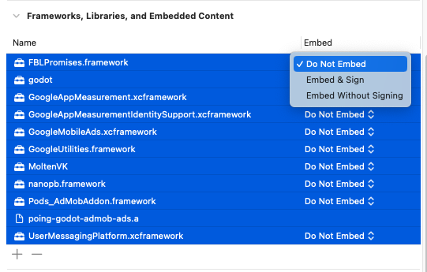

# Get Started

Integrating the AdMob plugin into your Godot project, specifically for Godot v4.1+, is the initial and crucial step in enabling ad displays and revenue generation. After successfully incorporating this plugin, you'll have the flexibility to select from various ad formats, like Banner or Interstitial, and proceed with the necessary implementation steps.

This document is based on:

- [Google Mobile Ads SDK Android Documentation](https://developers.google.com/admob/android/quick-start)
- [Google Mobile Ads SDK iOS Documentation](https://developers.google.com/admob/ios/quick-start)


## Prerequisites

- Use Godot v4.1 or higher
- Deploy Android:
	- `minSdkVersion` of 19 or higher
	- `compileSdkVersion` of 28 or higher
- Deploy iOS:
	- Use Xcode 14.1 or higher
	- Target iOS 11.0 or higher
	- [CocoaPods](https://guides.cocoapods.org/using/getting-started.html)
- Recommended: [Create an AdMob account](https://support.google.com/admob/answer/7356219?visit_id=638286911958663013-3847536692&rd=1) and [register an app](https://support.google.com/admob/answer/9989980?visit_id=638286911964685099-3190075945&rd=1).

## Download the Godot AdMob Plugin from Poing Studios

The Godot AdMob Plugin from Poing Studios simplifies the process for Godot developers to incorporate Google Mobile Ads into their Android and iOS apps, eliminating the need to write Java/Kotlin or Objective-C++ code. Instead, this plugin offers a GDScript-based interface for ad requests, which can be seamlessly integrated into your Godot project. 

To access the plugin, you can either download the Godot package provided or explore its source code on GitHub through the links below.

[Download from GitHub](https://github.com/Poing-Studios/godot-admob-plugin/releases/latest){ .md-button .md-button--primary } [Download from AssetLibrary](https://godotengine.org/asset-library/asset/2063){ .md-button .md-button--primary } [Source Code](https://github.com/Poing-Studios/godot-admob-plugin){ .md-button .md-button--primary }

### Importing the Godot AdMob Plugin on Project

The AdMob plugin for Godot is conveniently available via AssetLib. To import this plugin into your Godot project, follow these steps:

1. Open your Godot project.
2. Navigate to AssetLib within the Godot editor.
3. In the search bar, enter `AdMob` and ensure that the publisher is set to `poing.studios`.

4. Locate the AdMob plugin and click the `Download` button.
5. Once the download is complete, go to `Project > Project Settings` within the Godot editor.
6. In the `Plugins` section, find the `AdMob` plugin and activate it.

7. With these steps, you'll have successfully integrated the AdMob plugin into your Godot project without the need for additional manual file imports.

## Obtaining external libraries

=== "Android"
	To integrate the required Android library for AdMob in Godot, follow these steps:

	1. In Godot, navigate to `Project > Tools > AdMob Download Manager > Android > LatestVersion`.
	2. This action will download the appropriate Android library into your project, which is located at `res://addons/admob/downloads/android/`.

	If you encounter any issues with the download, you can try downloading the library manually by clicking [here](https://github.com/Poing-Studios/godot-admob-android/releases/latest).

=== "iOS"

	To integrate the required iOS library for AdMob in Godot, follow these steps:

	1. In Godot, navigate to `Project > Tools > AdMob Download Manager > iOS > LatestVersion`.
	2. This action will download the appropriate iOS library into your project, which is located at `res://addons/admob/downloads/ios/`.

	If you encounter any issues with the download, you can try downloading the library manually by clicking [here](https://github.com/Poing-Studios/godot-admob-ios/releases/latest).

### Installing 

=== "Android"

	1. Install the Android Build Template by navigating to `Project > Install Android Build Template`.

	2. Go to the directory `res://android/plugins/` and extract the contents of the `ads` folder from the downloaded `.zip` located at `res://addons/admob/downloads/android/`. If you have Mediation, do the same for `meta`, `adcolony` etc....
	

	3. Add your [AdMob App ID](https://support.google.com/admob/answer/7356431) to your app's ```res://android/build/AndroidManifest.xml``` file by adding a ```<meta-data>``` tag with name ```com.google.android.gms.ads.APPLICATION_ID```, as shown below. If you don't do this then you App will crash on start-up.
	``` xml
	<!-- Sample AdMob app ID: ca-app-pub-3940256099942544~3347511713 -->
	<meta-data
		android:name="com.google.android.gms.ads.APPLICATION_ID"
		android:value="ca-app-pub-xxxxxxxxxxxxxxxx~yyyyyyyyyy"/>
	```

	4. When exporting your project, select `Use Custom Build` and ensure that `Ad Mob` is enabled, If you have Mediation, also mark `Ad Mob Meta`, `Ad Mob AdColony` etc...
	


=== "iOS"

	1. Create the iOS Plugin folder if doesn't exists on `res://ios/plugins/`.

	2. Go to the directory `res://ios/plugins/` and extract the contents of the `ads` folder from the downloaded `.zip` located at `res://addons/admob/downloads/ios/`. If you have Mediation, do the same for `meta`, `adcolony` etc....
	

	3. Within `res://ios/plugins/poing-godot-admob-ads.gdip`, if you are using Mediation, locate the `SKAdNetworkItems` section. Here, you can remove the comments associated with the [Mediation Networks](https://developers.google.com/admob/ios/choose-networks) that you are using.
	

	4. When exporting your project, update the `GADApplicationIdentifier` with your [AdMob App ID](https://support.google.com/admob/answer/7356431) and and ensure that `Ad Mob` is enabled, If you have Mediation, also mark `Ad Mob Meta`, `Ad Mob AdColony` etc...
	

	5. Once exported, go to `{{ ios_xcode_export_folder }}/{{your_project_name}}/ios/plugins/poing-godot-admob/scripts/` folder and open the terminal (must be inside this folder) and run these commands:
	```bash
	chmod +x update_and_install.sh
	./update_and_install.sh
	```
	

	6. This will create for your a `{{ your_project_name }}.xcworkspace` (e.g.: `AdMobAddon.xcworkspace`) file on your `{{ ios_xcode_export_folder }}`, open this file.
	
	7. Go to the Target of your Application and them `General -> Frameworks, Libraries, and Embedded Content` and add all `Pods` in section.
	

	8. Select all Frameworks (⌘ + A) and put as `Do Not Embed`
	

	9. Run the Game.
	10. [If you are trying to run on Simulator and is not working read this](https://github.com/godotengine/godot/issues/44681#issuecomment-751399783).

## Initialize the Google Mobile Ads SDK
Prior to loading ads, ensure that your application initializes the Google Mobile Ads SDK. You can accomplish this by calling MobileAds.initialize(). This function initializes the SDK and triggers a completion listener once the initialization process is finished, or if it exceeds a 30-second timeout. It's important to note that this initialization should occur only once, ideally during the app's launch phase.

```gdscript
func _ready() -> void:
	MobileAds.initialize()
```

If you are utilizing mediation, it's essential to wait for the completion handler to be called before proceeding with ad loading. This step ensures that all mediation adapters are properly initialized before ad requests are made.

## Select an ad format
The Google Mobile Ads SDK is now successfully imported, and you are prepared to integrate an ad into your app. AdMob provides a variety of ad formats, allowing you to select the one that aligns best with your app's user experience.

### Banner
<div class="image-text-container">
  
  <p>Banner ads are rectangular advertisements, consisting of either images or text, that are integrated into an app's layout. These ads remain on the screen while users engage with the app and can automatically refresh after a designated time interval. If you're new to mobile advertising, banner ads provide an excellent starting point for your ad implementation journey.</p>
</div>

[Implement banner ads](ad_formats/banner.md){ .md-button .md-button--primary }

### Interstitial
<div class="image-text-container">
  
  <p>Interstitial ads are expansive, full-screen advertisements that overlay an app's interface and persist until they are closed by the user. They are most effective when strategically placed during natural pauses in the app's execution, such as between levels of a game or immediately after the completion of a task.</p>
</div>

[Implement interstitial ads](https://github.com/Poing-Studios/godot-admob-plugin/releases/latest){ .md-button .md-button--primary }

### Rewarded
<div class="image-text-container">
  
  <p>Rewarded video ads are immersive, full-screen video advertisements that provide users with the choice to watch them entirely. In return for their time and attention, users receive in-app rewards or benefits.</p>
</div>

[Implement rewarded ads](https://github.com/Poing-Studios/godot-admob-plugin/releases/latest){ .md-button .md-button--primary }

### Rewarded Interstitial
<div class="image-text-container">
  
  <p>A Rewarded Interstitial is a specific form of incentivized ad format that allows you to provide rewards in exchange for ads that appear automatically during natural app transitions. Unlike regular rewarded ads, users are not obligated to actively opt in to view a Rewarded Interstitial; they are seamlessly integrated into the app experience.</p>
</div>

[Implement rewarded interstitial ads](https://github.com/Poing-Studios/godot-admob-plugin/releases/latest){ .md-button .md-button--primary }

<style>
  .image-text-container {
    display: flex;
    align-items: center;
  }
  .image-text-container img {
    margin-right: 20px;
    max-width: 200px;
    height: auto;
  }
</style>
