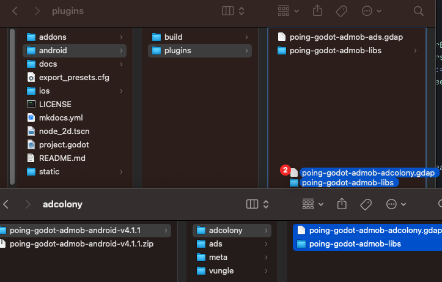
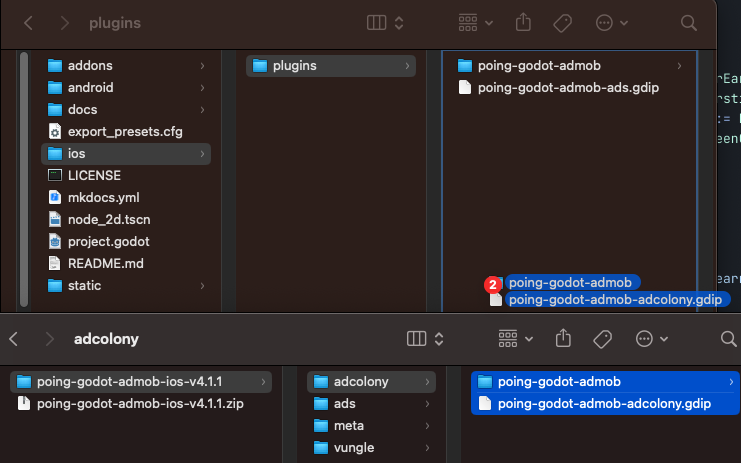
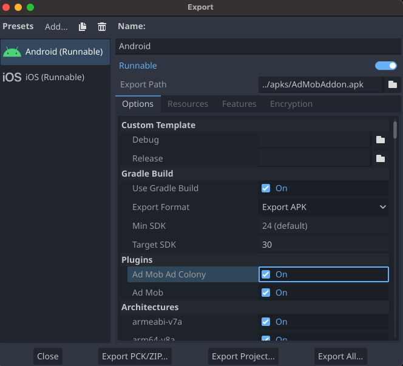
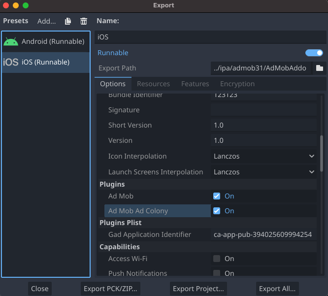

# Integrate AdColony with Mediation

This guide demonstrates how to employ the Google Mobile Ads SDK to load and showcase ads from AdColony through [mediation](../get_started.md), encompassing both bidding and waterfall integration approaches. It elucidates the process of incorporating AdColony into an ad unit's mediation configuration and integrating the AdColony SDK and adapter into a Godot app.

This document is based on:

- [Google Mobile Ads SDK Android Documentation](https://developers.google.com/admob/android/mediation/adcolony)
- [Google Mobile Ads SDK iOS Documentation](https://developers.google.com/admob/ios/mediation/adcolony)

## Supported integrations and ad formats

The AdMob mediation adapter for AdColony has the following capabilities:

| Integration |   |
|-------------|---|
| Bidding     | ✅ |
| Waterfall   | ✅ |

| Formats      |   |
|--------------|---|
| Banner       | ✅ |
| Interstitial | ✅ |
| Rewarded     | ✅ |


## Prerequisites
- Godot 4.1+
- Latest [Godot AdMob Plugin](https://github.com/poingstudios/godot-admob-plugin/releases/latest) 
- Android deploy:
    - Android API level 19 or higher
    - Latest [Godot AdMob Android Plugin](https://github.com/poingstudios/godot-admob-android/releases/latest)
- iOS deploy:
    - iOS deployment target of 11.0 or higher
    - Latest [Godot AdMob iOS Plugin](https://github.com/poingstudios/godot-admob-ios/releases/latest)
- Complete the [Get started guide](../../README.md)
- Complete the mediation [Get started guide](../get_started.md)

## Step 1: Set up AdColony:
We recommend following the tutorial for [Android](https://developers.google.com/admob/android/mediation/adcolony#step_1_set_up_adcolony) or [iOS](https://developers.google.com/admob/ios/mediation/adcolony#step_1_set_up_adcolony), as it will be the same for both.


## Step 2: Configure mediation settings for your AdMob ad unit
We recommend following the tutorial for [Android](https://developers.google.com/admob/android/mediation/adcolony#configure-mediation) or [iOS](https://developers.google.com/admob/ios/mediation/adcolony#configure-mediation), as it will be the same for both.

## Step 3: Import the AdColony plugin

1. Download the plugin for [Android](https://github.com/poingstudios/godot-admob-android/releases/latest) and/or [iOS](https://github.com/poingstudios/godot-admob-ios/releases/latest).
2. Extract the `.zip` file. Inside, you will find an `adcolony` folder.
3. Copy the contents of the `adcolony` folder and paste the copied contents into the Android and/or iOS plugin folder.

    === "Android"
        

    === "iOS"
        

4. When export make sure to mark `Ad Mob` and `Ad Mob Ad Colony`

    === "Android"
        

    === "iOS"
        

## Step 4: Additional code required

=== "Android"
    No additional code is required for AdColony integration.

=== "iOS"
    **SKAdNetwork integration**

    Follow [AdColony's documentation](https://support.adcolony.com/helpdesk/network-ids-for-skadnetwork-ios-only/) to add the SKAdNetwork identifiers to your project's `Info.plist` file.

## Step 5: Test your implementation
We recommend following the tutorial for [Android](https://developers.google.com/admob/android/mediation/adcolony#step_5_test_your_implementation) or [iOS](https://developers.google.com/admob/ios/mediation/adcolony#step_5_test_your_implementation), as it will be the same for both.


## Optional steps

!!! info
    
    **Important**: Please verify you have **Account Management** permission to complete configuration for EU Consent and GDPR, CCPA, and User Messaging Platform. To learn more please see the following [new user roles](https://support.google.com/admob/answer/2784628) article.

=== "Android"
    **Permissions**

    For optimal performance, AdColony recommends including the following [optional permissions](https://github.com/AdColony/AdColony-Android-SDK/wiki/Project-Setup#step-2-edit-manifest) in the `AndroidManifest.xml` file located under the `res://android/build` directory of your Godot project.

    ```xml
    <uses-permission android:name="android.permission.VIBRATE" />
    ```

=== "iOS"
    No additional code is required for AdColony integration.

Network-specific parameters
The AdColony mediation package supports additional configuration and request parameters, which can be passed to the adapter using the `AdColonyMediationExtras` and `AdColonyAppOptions` classes.

### AdColonyMediationExtras

- `show_post_popup : bool`: Sets whether or not to show a popup before displaying an ad. Set to false if you don't want to show a popup before ads display.
- `show_pre_popup : bool`: Sets whether or not to show a popup after displaying an ad. Set to false if you don't want to show a popup after ads display.

### AdColonyAppOptions

- `set_user_id(string)`: Sets the User ID for the AdColony SDK, providing further analytics to the AdColony Ad Server.
- `set_test_mode(bool)`: Sets whether or not to enable test mode for the AdColony SDK.

Here's a code example of how to set these configurations and ad request parameters:

```gdscript
# Using AdColonyAppOptions
var adcolony_app_options := AdColonyAppOptions.new()
adcolony_app_options.set_user_id("your_user_id")
adcolony_app_options.set_test_mode(true)

# Using AdColonyMediationExtras
var ad_request := AdRequest.new()

var ad_colony_mediation_extras := AdColonyMediationExtras.new()
ad_colony_mediation_extras.show_post_popup = false
ad_colony_mediation_extras.show_pre_popup = true

ad_request.mediation_extras.append(ad_colony_mediation_extras)
```

### EU consent and GDPR
Under the Google [EU User Consent Policy](https://www.google.com/about/company/consentstaging.html), it's mandatory to provide certain disclosures and obtain consents from users within the European Economic Area (EEA) regarding the utilization of device identifiers and personal data. This policy aligns with the EU ePrivacy Directive and the General Data Protection Regulation (GDPR). When seeking consent, you must explicitly identify each ad network within your mediation chain that may collect, receive, or utilize personal data. Additionally, you should furnish information about how each network intends to use this data. Importantly, Google currently cannot automatically transmit the user's consent choice to these networks.

The AdColony plugin offers the `AdColonyAppOptions` class, enabling you to customize parameters sent to AdColony's SDK. Among these options, two are pertinent to GDPR compliance: `set_privacy_framework_required()` and `set_privacy_consent_string()`. Below is a sample code snippet illustrating how to convey consent information to the AdColony adapter. These settings must be configured before [initializing the Google Mobile Ads SDK](../../README.md#initialize-the-google-mobile-ads-sdk) to ensure seamless forwarding to AdColony's SDK.

```gdscript
var adcolony_app_options := AdColonyAppOptions.new()

# Set GDPR consent parameters
adcolony_app_options.set_privacy_framework_required(AdColonyAppOptions.GDPR, true)
adcolony_app_options.set_privacy_consent_string(AdColonyAppOptions.GDPR, "myPrivacyConsentString")
```

Check the detailed information about AdColony's [consumer privacy policies](https://www.adcolony.com/consumer-privacy/) and implementation [guidelines related to privacy laws](https://github.com/AdColony/AdColony-Android-SDK/wiki/Privacy-Laws#gdpr).


#### Add AdColony to GDPR ad partners list
Follow the steps in [GDPR settings](https://support.google.com/admob/answer/10113004#adding_ad_partners_to_published_gdpr_messages) to add AdColony to the GDPR ad partners list in the AdMob UI.


### CCPA
The [California Consumer Privacy Act (CCPA)](https://support.google.com/admob/answer/9561022) mandates that California state residents have the right to opt out of the "sale" of their "personal information," as defined by the law. This opt-out option should be prominently displayed through a "Do Not Sell My Personal Information" link on the homepage of the party engaging in the sale.

The [CCPA preparation](../../privacy/regulatory_solutions/us_states_privacy_laws.md) guide offers a feature to enable [restricted data processing](https://privacy.google.com/businesses/rdp/) for Google ad serving. However, Google cannot apply this setting to every ad network within your mediation chain. Therefore, it is essential to identify each ad network in your mediation chain that might be involved in the sale of personal information and follow the specific guidance provided by each of those networks to ensure CCPA compliance.

The AdColony plugin offers the `AdColonyAppOptions` class, enabling you to customize parameters sent to AdColony's SDK. Among these options, two are pertinent to CCPA compliance: `set_privacy_framework_required()` and `set_privacy_consent_string()`. Below is a sample code snippet illustrating how to convey consent information to the AdColony adapter. These settings must be configured before [initializing the Google Mobile Ads SDK](../../README.md#initialize-the-google-mobile-ads-sdk) to ensure seamless forwarding to AdColony's SDK.

```gdscript
var adcolony_app_options := AdColonyAppOptions.new()

# Set CCPA consent parameters
adcolony_app_options.set_privacy_framework_required(AdColonyAppOptions.CCPA, true)
adcolony_app_options.set_privacy_consent_string(AdColonyAppOptions.CCPA, "myPrivacyConsentString")
```

Check the detailed information about AdColony's [consumer privacy policies](https://www.adcolony.com/consumer-privacy/) and implementation [guidelines related to privacy laws](https://github.com/AdColony/AdColony-Android-SDK/wiki/Privacy-Laws#ccpa).

#### Add AdColony to CCPA ad partners list
Follow the steps in [CCPA settings](https://support.google.com/admob/answer/10860309) to add **AdColony** to the CCPA ad partners list in the AdMob UI.

## Error codes
If the AdColony adapter fails to receive an ad, publishers can check the underlying error from the ad response using `ResponseInfo` under the following classes:


=== "Android"
    ```
    com.jirbo.adcolony.AdColonyAdapter
    com.google.ads.mediation.adcolony.AdColonyMediationAdapter
    ```

=== "iOS"
    ```
    GADMAdapterAdColony
    GADMediationAdapterAdColony
    ```

Here are the codes and accompanying messages thrown by the AdColony adapter when an ad fails to load:

=== "Android"
    | Error code | Reason                                                                        |
    |------------|-------------------------------------------------------------------------------|
    | 100        | The AdColony SDK returned an error.                                           |
    | 101        | Invalid server parameters (e.g. missing Zone ID).                             |
    | 102        | An ad was already requested for the same Zone ID.                             |
    | 103        | The AdColony SDK returned an initialization error.                            |
    | 104        | The requested banner size does not map to a valid AdColony ad size.           |
    | 105        | Presentation error due to ad not loaded.                                      |
    | 106        | Context used to initialize the AdColony SDK was not an **Activity** instance. |

=== "iOS"
    | Error code         | Reason                      |
    |--------------------|-----------------------------|
    | 0 - 3              | AdColony SDK returned an error. See [documentation](https://adcolony-www-common.s3.amazonaws.com/Appledoc/4.4.1/Constants/AdColonyRequestError.html) for more details. |
    | 101                | Invalid server parameters (e.g. missing Zone ID). |
    | 102                | Root view controller presenting the ad is **nil**. |
    | 103                | The AdColony SDK returned an initialization error. |
    | 104                | The AdColony SDK does not support being configured twice within a five second period. |
    | 105                | Failed to show ad. |
    | 106                | Zone used for rewarded is not a rewarded zone on AdColony portal. |