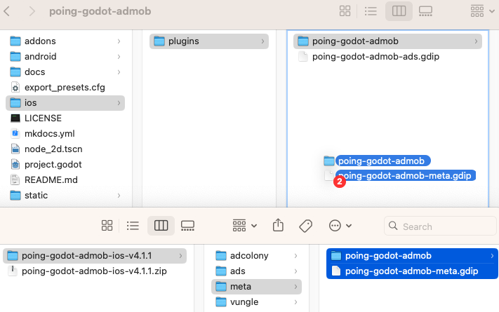
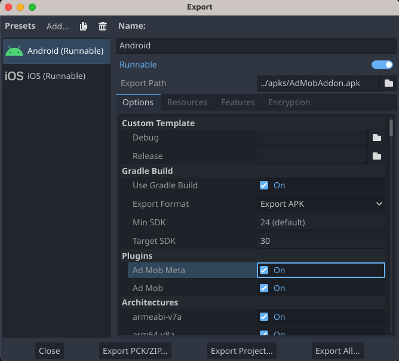
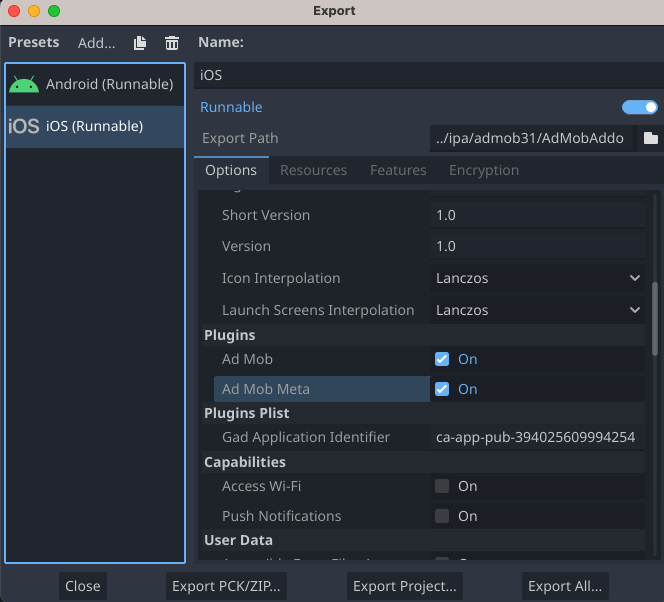

# Integrate Meta Audience Network with bidding
!!! info
    
    **Important**: Facebook Audience Network is now Meta Audience Network. See [Meta's announcement](https://about.fb.com/news/2021/10/facebook-company-is-now-meta/) for more information.

This guide explains how to utilize the Google Mobile Ads SDK for loading and presenting ads from the Meta Audience Network through [mediation](../get_started.md), with a focus on bidding integrations. It provides instructions on integrating the Meta Audience Network into the mediation configuration of a Godot app and integrating the Meta Audience Network SDK and adapter into your Godot app.

This document is based on:

- [Google Mobile Ads SDK Android Documentation](https://developers.google.com/admob/android/mediation/meta)
- [Google Mobile Ads SDK iOS Documentation](https://developers.google.com/admob/ios/mediation/meta)

## Supported integrations and ad formats

The AdMob mediation adapter for Meta Audience Network has the following capabilities:

| Integration |   |
|-------------|---|
| Bidding     | ✅ |
| Waterfall [^1]   | ❌ |

| Formats      |   |
|--------------|---|
| Banner       | ✅ |
| Interstitial | ✅ |
| Rewarded     | ✅ |

[^1]: Meta Audience Network became [bidding only](https://www.facebook.com/audiencenetwork/resources/blog/audience-network-to-become-bidding-only-beginning-with-ios-in-2021) in 2021.

## Prerequisites
- Godot 4.1+
- Latest [Godot AdMob Plugin](https://github.com/poingstudios/godot-admob-plugin/releases/latest) 
- Android deploy:
    - Android API level 19 or higher
    - Latest [Godot AdMob Android Plugin](https://github.com/poingstudios/godot-admob-android/releases/latest)
- iOS deploy:
    - iOS deployment target of 11.0 or higher
    - Latest [Godot AdMob iOS Plugin](https://github.com/poingstudios/godot-admob-ios/releases/latest)
- Complete the [Get started guide](../../README.md)
- Complete the mediation [Get started guide](../get_started.md)

## Step 1: Set up Meta Audience Network
We recommend following the tutorial for [Android](https://developers.google.com/admob/android/mediation/meta#setup) or [iOS](https://developers.google.com/admob/ios/mediation/meta#setup), as it will be the same for both.

## Step 2: Configure mediation settings for your AdMob ad unit
We recommend following the tutorial for [Android](https://developers.google.com/admob/android/mediation/meta#configure_mediation) or [iOS](https://developers.google.com/admob/ios/mediation/meta#configure_mediation), as it will be the same for both.

## Step 3: Import the Meta Audience Network plugin

1. Download the plugin for [Android](https://github.com/poingstudios/godot-admob-android/releases/latest) and/or [iOS](https://github.com/poingstudios/godot-admob-ios/releases/latest).
2. Extract the `.zip` file. Inside, you will find an `meta` folder.
3. Copy the contents of the `meta` folder and paste the copied contents into the Android and/or iOS plugin folder.

    === "Android"
        

    === "iOS"
        

4. When export make sure to mark `Ad Mob` and `Ad Mob Meta`

    === "Android"
        

    === "iOS"
        

## Step 4: Additional code required

=== "Android"
    No additional code is required for Meta Audience Network integration.

=== "iOS"
    **SKAdNetwork integration**

    Follow [Meta Audience Network's documentation](https://developers.facebook.com/docs/setting-up/platform-setup/ios/SKAdNetwork) to add the SKAdNetwork identifiers to your project's `Info.plist` file.

    ---
    **Compile errors**

    You must follow the steps below to add Swift paths to your target's Build Settings to prevent compile errors.

    Add the following paths to the target's **Build Settings** under **Library Search Paths**:

    ```
    $(TOOLCHAIN_DIR)/usr/lib/swift/$(PLATFORM_NAME)
    $(SDKROOT)/usr/lib/swift
    ```

    Add the following path to the target's **Build Settings** under **Runpath Search Paths**:
    ```
    /usr/lib/swift
    ```

    Read more about: https://developers.google.com/admob/ios/mediation/meta#step_4_additional_code_required

    ---
    **Advertising tracking enabled**

    If you are building for iOS 14 or later, Meta Audience Network requires that you explicitly set their [Advertising Tracking Enabled](https://developers.facebook.com/docs/audience-network/setting-up/platform-setup/ios/advertising-tracking-enabled) flag using the following code:

    !!! info
        
        **Important Point**: You need to set this flag prior to initializing the Mobile Ads SDK.

    ```gdscript
    if OS.get_name() == "iOS":
        #FBAdSettings is available only for iOS, Google didn't put this method on Android SDK
        FBAdSettings.set_advertiser_tracking_enabled(true)
    ```

## Step 5: Test your implementation
We recommend following the tutorial for [Android](https://developers.google.com/admob/android/mediation/meta#step_5_test_your_implementation) or [iOS](https://developers.google.com/admob/ios/mediation/meta#step_5_test_your_implementation), as it will be the same for both.


## Optional steps

!!! info
    
    **Important**: Please verify you have **Account Management** permission to complete configuration for EU Consent and GDPR, CCPA, and User Messaging Platform. To learn more please see the following [new user roles](https://support.google.com/admob/answer/2784628) article.


### EU consent and GDPR
Under the Google [EU User Consent Policy](https://www.google.com/about/company/consentstaging.html), it's mandatory to provide certain disclosures and obtain consents from users within the European Economic Area (EEA) regarding the utilization of device identifiers and personal data. This policy aligns with the EU ePrivacy Directive and the General Data Protection Regulation (GDPR). When seeking consent, you must explicitly identify each ad network within your mediation chain that may collect, receive, or utilize personal data. Additionally, you should furnish information about how each network intends to use this data. Importantly, Google currently cannot automatically transmit the user's consent choice to these networks.

Please review Meta's [guidance](https://www.facebook.com/business/gdpr) for information about GDPR and Meta advertising.

#### Add Facebook to GDPR ad partners list
Follow the steps in [GDPR settings](https://support.google.com/admob/answer/10113004#adding_ad_partners_to_published_gdpr_messages) to add **Facebook** to the GDPR ad partners list in the AdMob UI.


### CCPA
The [California Consumer Privacy Act (CCPA)](https://support.google.com/admob/answer/9561022) mandates that California state residents have the right to opt out of the "sale" of their "personal information," as defined by the law. This opt-out option should be prominently displayed through a "Do Not Sell My Personal Information" link on the homepage of the party engaging in the sale.

The [CCPA preparation](../../privacy/regulatory_solutions/us_states_privacy_laws.md) guide offers a feature to enable [restricted data processing](https://privacy.google.com/businesses/rdp/) for Google ad serving. However, Google cannot apply this setting to every ad network within your mediation chain. Therefore, it is essential to identify each ad network in your mediation chain that might be involved in the sale of personal information and follow the specific guidance provided by each of those networks to ensure CCPA compliance.

Please review Meta's [documentation](https://developers.facebook.com/docs/marketing-apis/data-processing-options) for data processing options for users in California.

#### Add Facebook to CCPA ad partners list
Follow the steps in [CCPA settings](https://support.google.com/admob/answer/10860309) to add **Facebook** to the CCPA ad partners list in the AdMob UI.

### Caching
=== "Android"
    **Android 9**:

    Starting with Android 9 (API level 28), [cleartext support is disabled by default](https://developer.android.com/training/articles/security-config#CleartextTrafficPermitted), which will affect the functionality of media caching of the Meta Audience Network SDK and could affect user experience and ads revenue. Follow [Meta's documentation](https://developers.facebook.com/docs/audience-network/android-network-security-config/) to update the network security configuration in your app.

=== "iOS"
    Not applicable.

## Error codes
If the adapter fails to receive an ad from Audience Network, publishers can check the underlying error from the ad response using `ResponseInfo` under the following classes:

=== "Android"
    ```
    com.google.ads.mediation.facebook.FacebookAdapter
    com.google.ads.mediation.facebook.FacebookMediationAdapter
    ```

=== "iOS"
    ```
    GADMAdapterFacebook
    GADMediationAdapterFacebook
    ```

Here are the codes and accompanying messages thrown by the Meta Audience Network adapter when an ad fails to load:

=== "Android"
    | Error code | Reason                                                                                                   |
    |------------|----------------------------------------------------------------------------------------------------------|
    | 101        | Invalid server parameters (e.g. missing Placement ID).                                                   |
    | 102        | The requested ad size does not match a Meta Audience Network supported banner size.                      |
    | 103        | The publisher must request ads with an **Activity** context.                                             |
    | 104        | The Meta Audience Network SDK failed to initialize.                                                      |
    | 105        | The publisher did not request for Unified native ads.                                                    |
    | 106        | The native ad loaded is a different object than the one expected.                                        |
    | 107        | The **Context** object used is invalid.                                                                  |
    | 108        | The loaded ad is missing the required native ad assets.                                                  |
    | 109        | Failed to create a native ad from the bid payload.                                                       |
    | 110        | The Meta Audience Network SDK failed to present their interstitial/rewarded ad.                          |
    | 111        | Exception thrown when creating a Meta Audience Network **AdView** object.                                |
    | 1000-9999  | The Meta Audience Network returned an SDK-specific error. See Meta Audience Network's [documentation](https://developers.facebook.com/docs/audience-network/setting-up/test/checklist-errors) for more details. |

=== "iOS"
    | Error code | Reason                                                                                                                |
    |------------|-----------------------------------------------------------------------------------------------------------------------|
    | 101        | Invalid server parameters (e.g. missing Placement ID).                                                                |
    | 102        | The requested ad size does not match a Meta Audience Network supported banner size.                                   |
    | 103        | The Meta Audience Network ad object failed to initialize.                                                             |
    | 104        | The Meta Audience Network SDK failed to present their interstitial/rewarded ad.                                       |
    | 105        | Root view controller of the banner ad is **nil**.                                                                     |
    | 106        | The Meta Audience Network SDK failed to initialize.                                                                   |
    | 1000-9999  | The Meta Audience Network returned an SDK-specific error. See Meta Audience Network's [documentation](https://developers.facebook.com/docs/audience-network/setting-up/test/checklist-errors) for more details. |